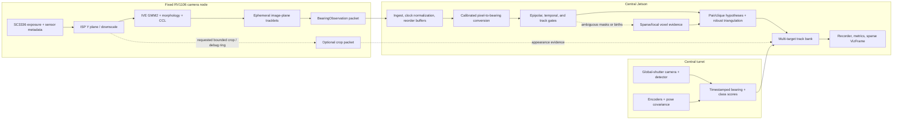

# Skyweave architecture research report

**Date:** 2026-07-15<br>
**Status:** Research-backed architecture recommendation, not a frozen product specification<br>
**Audience:** Samuel as system architect and reviewer

> **2026-07-17 refinement:** The current choices and direct answers are in
> [FOLLOWUP_DECISIONS_2026-07-17.md](./FOLLOWUP_DECISIONS_2026-07-17.md).
> In particular, “4D evidence” now means timestamped `(x,y,z,t)` evidence
> records/ring-buffer history; a finite-lag smoother is optional later. The
> first target is an 800 ft Blender full-stack replay, the RV1106 GMM2 spike is
> immediate, the turret is later, and physical pose calibration is expected to
> use F9P RTK plus optical orientation refinement.
>
> **2026-07-20 execution update:** The first system milestone is now the
> synthetic pipeline over real wiring: deterministic Blender Y sequences are
> replayed by physical nodes through the real switch/UDP path to the Jetson.
> Real CSI/PTS/GMM2 behavior and outdoor noise are the following adaptation
> phase. See the current order in
> [IMPLEMENTATION_FRAMEWORK.md](./IMPLEMENTATION_FRAMEWORK.md) and the
> step-by-step [SKYWEAVE_PROJECT_GUIDE.md](./SKYWEAVE_PROJECT_GUIDE.md).

## Authority and evidence

The two notes attached to the 2026-07-15 Codex conversation are the current,
human-authored design intent:

- [Ray-array brain dump](/Users/samuelmccanahan/.codex/attachments/5ad1a766-dae6-42fc-9661-aeaad400c755/pasted-text.txt)
- [Flying-object system notes](/Users/samuelmccanahan/.codex/attachments/9e5b26d5-9a0b-4e4c-9857-4008295ad8b3/pasted-text.txt)

The old `v1` implementation, tests, recordings, deleted/old specifications, and
golden files are evidence about what has run. They are not architectural
authority. This report deliberately separates:

- **Established:** supported by geometry, standards, vendor APIs, current code,
  or measured tests.
- **Plausible:** technically credible but still unmeasured on the exact
  Skyweave hardware.
- **Hypothesis:** an idea that needs a designed experiment.
- **Rejected as a requirement:** contradicted by geometry or current evidence.

## Executive verdict

Skyweave's central idea is sound: it is a distributed, calibrated,
bearing-only localization system. A camera observation becomes a ray (more
precisely, a bearing with uncertainty), and observations from spatially
separated cameras constrain a target in 3D.

The clean redesign should not make a dense voxel volume the primary estimator.
For compact targets with known cross-camera correspondence, continuous robust
triangulation is both cheaper and more accurate. Sparse or track-local voxel
evidence remains useful when correspondence is ambiguous, the observation is a
silhouette rather than a point, or the UI needs an intuitive volume.

The real difficulty is not casting rays. It is maintaining the truth attached
to every ray:

1. which physical feature the pixel represents;
2. when that pixel was exposed;
3. the calibrated camera model and pose used to unproject it;
4. the uncertainty in all of the above; and
5. which observations across cameras belong to the same object.

The recommended production spine is:

```text
sensor exposure
  -> edge foreground proposal
  -> timestamped pixel observation + uncertainty
  -> world-frame bearing
  -> cross-camera hypotheses / association
  -> robust continuous triangulation or bearing update
  -> multi-target track bank
  -> optional turret bearing + appearance evidence
  -> sparse visualization and immutable event log
```

The edge reports what it observed. The central node decides what observations
jointly mean.

### The strongest corrections to the current notes

- Accuracy does not scale linearly with camera count. Comparable independent
  random error often falls approximately as `1 / sqrt(N)`, while common
  calibration and timing biases do not average away.
- At 25,000–35,000 ft with a maximum 450 ft baseline, 1–10 inch range accuracy
  is not credible. Rough 3D tracking of a large aircraft may be, depending on
  optics, contrast, calibration, and timing.
- A turret camera contributes a high-rate bearing and appearance cue. It does
  not provide instantaneous range by itself.
- GMM2 is a good edge proposal generator, not an object recognizer. It does not
  solve birds, clouds, rain, camera shake, or slowly moving targets.
- RTP timestamps are not automatically comparable across nodes. Capture-time
  semantics and clock mapping must be explicit.
- A BNO055 is a setup prior and movement alarm, not a precision extrinsic
  calibration source.
- A UKF is not automatically required because aircraft or drones maneuver.
  Start with the simplest estimator consistent with the measurement model.
- `W(x,y,z,t)` should initially mean timestamped `(x,y,z,t)` evidence points
  and a bounded history/ring buffer, not a dense four-dimensional tensor. A
  finite-lag smoother is a separate optional estimator for delayed data.
- Isaac Sim is useful for rendered, ground-truthed scenes. RKAIQ is an ISP and
  camera-tuning stack, not a scene simulator and not proof that the RV1106 data
  path or timing works.

## 1. Define two operating regimes instead of one vague target

The notes combine two physically different problems. They should share
contracts and infrastructure, but not accuracy assumptions.

| Regime | High-altitude aircraft | Local drone / paper airplane |
|---|---|---|
| Typical range | 25,000–35,000 ft slant-range order | Tens to hundreds of metres |
| Apparent size | Often a few to a few dozen pixels, optics-dependent | Potentially much larger |
| Parallax with 450 ft baseline | Less than roughly 1 degree | Potentially strong |
| Dominant challenge | Optics, subpixel bias, calibration, weak depth geometry | Timestamping, rolling shutter, high angular rate, occlusion |
| Weather/lighting | Daylight and clear-sky limitations are fundamental | More controllable test conditions |
| Sensible first output | Bearing plus coarse anisotropic 3D track | Higher-rate 3D track if timing is measured |

The first scientific milestone should be a controlled single-target experiment
at a measured local range. It should prove calibration, exposure timing,
triangulation covariance, and replay repeatability before any high-altitude
accuracy claim.

## 2. Truth audit of the human notes

| Idea from the notes | Verdict | Engineering consequence |
|---|---|---|
| Cast rays from known cameras and combine them | **Established** | This is calibrated multi-view bearing-only localization. |
| Average non-intersecting rays | **Partly correct** | A least-squares closest-point solve is a useful initializer; refine with weighted angular or reprojection residuals. |
| Add cameras for linear accuracy | **Rejected as stated** | Information depends on projected baseline, viewing geometry, and independent noise. Add cameras for geometry, robustness, and coverage, not a promised linear gain. |
| Use dense voxels for reconstruction | **Optional representation** | Use continuous triangulation first. Use sparse/coarse-to-fine or track-local volumes only where ambiguity warrants them. |
| GMM2 on RV1106 IVE with luma | **Plausible and vendor-supported** | The official API accepts U8 single-channel input. Exact clone-board memory, SDK, FPS, and buffer behavior still require an on-device spike. |
| GMM2 equals a fixed 30-frame reference average | **Incorrect model** | GMM2 is an adaptive per-pixel mixture model with warm-up and update behavior. A fixed average is a separate baseline detector. |
| Send an entire SC3336 frame over 100 MbE | **Rejected at normal full-rate settings** | Full-resolution uncompressed luma alone is about 724 Mbit/s at 30 fps. Send metadata and optional bounded crops. |
| Custom UDP for low latency | **Reasonable** | Use small versioned measurement datagrams plus a reliable control/debug plane. Handle loss, duplication, reorder, and schema compatibility explicitly. |
| RTP timestamps synchronize nodes | **Incorrect** | RTP stream clocks have independent offsets unless mapped to a shared clock, normally through RTCP sender reports. |
| Add an MCU for timestamping | **Conditional** | It helps only if it observes or controls exposure/VSYNC and is tied to a shared time reference. Packet-arrival timestamping cannot reconstruct exposure time. |
| BNO055 for camera pitch/roll | **Useful prior only** | Use for rough installation and mount-movement detection. Optical/survey calibration determines final pose. |
| Giant AprilTag at the central node | **Possible bootstrap** | One distant planar target can be poorly conditioned. Prefer multiple separated control points or a varied trajectory. |
| ADS-B reverse calibration | **Weak factor / validation source** | Model latency, altitude datum, NACp/NIC, and antenna-to-object differences. Do not call it ground truth without quality bounds. |
| Sun-based calibration | **Partial orientation constraint** | It cannot recover translation and leaves rotation about the sun vector unresolved without another reference. |
| RTK drone calibration | **Strong proposed method** | Measure GNSS-antenna-to-visible-target lever arm, synchronize time, fly a geometrically rich trajectory, and reserve held-out flights for validation. |
| Rolling-shutter transform | **Real issue, conditional implementation** | Retain centroid row, frame reference semantics, readout direction, exposure, and line delay now; implement correction after measurement. |
| Central 100 fps global-shutter turret | **Useful bearing/appearance sensor** | Encoder pose and time must be calibrated. It does not replace a spatial baseline. |
| UKF for nonlinear flight | **Premature choice** | Constant-velocity/acceleration dynamics are linear. Nonlinearity comes from direct bearing projection; compare KF/EKF/UKF using replay evidence. |
| IMM trained/tuned in simulation | **Later experiment** | Add only if residuals reveal distinct useful motion modes. Simulation can evaluate it; it does not remove the need for real data. |
| Motion profile identifies object type | **Supporting evidence only** | A bird, drone, balloon, or aircraft can overlap in short trajectory windows. Accumulate motion, apparent scale, appearance, and context probabilistically. |
| Edge classifier rejects birds | **Unsafe initially** | Tiny distant targets may contain no semantic pixels. Classify persistent central/turret crops and do not hard-reject evidence at the edge. |
| Dense 4D evidence field | **Rejected as the default state** | Record immutable time-stamped observations and maintain a bounded fixed-lag track/evidence window. |
| CUDA central detector/scorer | **Profile-driven optimization** | Direct hypotheses may make localization cheap enough in Python/NumPy. Accelerate only a measured hot path. |
| Isaac Sim can validate the idea | **Useful but insufficient** | It validates algebra and controlled perception cases. Inject clock, rolling-shutter, calibration, weather, compression, and model mismatch independently. |
| System fails in clouds/night | **Correct limitation** | Treat operating conditions as part of the specification and node health, not as a bug a filter is assumed to solve. |

## 3. Quantitative feasibility

### 3.1 Long-range geometry

For target range `Z`, useful projected baseline `B_perp`, and relative bearing
error `sigma_theta`:

```math
alpha approx B_perp / Z

sigma_range approx (Z^2 / B_perp) sigma_theta

sigma_cross-range approx Z sigma_theta
```

This quadratic range-error growth is the central limit of long-baseline
triangulation. The [mrcal triangulation uncertainty
analysis](https://mrcal.secretsauce.net/triangulation.html) derives the same
behavior and also distinguishes observation noise from shared calibration
uncertainty.

Using 450 ft (137.16 m) as an optimistic fully projected baseline:

| Quantity | 25,000 ft (7,620 m) | 35,000 ft (10,668 m) |
|---|---:|---:|
| Approximate triangulation angle | 1.03 degrees | 0.74 degrees |
| Range sigma at an illustrative 0.1 mrad relative-bearing error | 42 m | 83 m |
| Cross-range sigma at 0.1 mrad | 0.76 m | 1.07 m |
| Relative-bearing error required for 10-inch range sigma | 0.124 arcsec | 0.063 arcsec |

The 0.1 mrad value is illustrative, not a prediction of this system. It is
already much smaller than many practical mount, lens, timestamp, and
centroid-systematic errors. The final row shows why inch-scale depth at
airliner range cannot be an MVP requirement.

### 3.2 What the SC3336 pixel budget implies

SmartSens lists SC3336 as a 3 MP, 2312 x 1304, 2.45 micrometre rolling-shutter
sensor at up to 30 fps on its [official product
page](https://www.smartsenstech.com/en/products_list?products_label=sc).

The following is an optics illustration, not a camera promise. Assume the full
2312-pixel width, a 30,000 ft (9,144 m) target, perfect calibration, and a
450 ft projected baseline:

| Horizontal FOV assumption | Approx. focal length | Cross-range represented by 1 pixel | Approx. one-pixel disparity depth step | 65 m / 10 m / 1 m target width |
|---|---:|---:|---:|---:|
| 60 degrees | 2,002 px | 4.57 m | 304 m | 14.2 / 2.19 / 0.22 px |
| 30 degrees | 4,314 px | 2.12 m | 141 m | 30.7 / 4.72 / 0.47 px |

Multi-view estimation and a stable point-spread function can localize some
features to a fraction of a pixel, but subpixel precision does not erase lens,
pose, time, atmospheric, and object-centroid biases. A one-metre drone at that
range is below one pixel in either illustration.

The optics/FOV choice is therefore an architecture input. “3 MP camera” alone
does not define detectability or localization accuracy.

### 3.3 Timing budget

A timestamp error produces along-trajectory position mismatch of approximately
`v * delta_t`:

| Target speed | 1 ms time error | 5 ms time error |
|---|---:|---:|
| 30 m/s drone | 3 cm | 15 cm |
| 250 m/s aircraft | 25 cm | 1.25 m |

The pixel-domain timing error is more directly:

```math
pixel_error approx focal_length_px * angular_rate_rad_per_s * time_error_s
```

This is how the allowable timestamp error should be derived for a target
profile. Network latency can vary without biasing geometry if capture time is
accurate and packets arrive before the estimator's lateness limit. A precise
receive timestamp attached to an unknown exposure time is not enough.

Linux camera APIs distinguish timestamp source and whether a buffer timestamp
describes start of exposure or end of frame when the driver can provide it;
see the [V4L2 buffer timestamp
flags](https://www.kernel.org/doc/html/latest/userspace-api/media/v4l/buffer.html).
The RV1106 SDK exposes frame PTS and sequence fields, but their exact relation
to exposure and a common clock must be measured on this camera/driver path.

### 3.4 Network budget

For 2312 x 1304 at 30 fps:

| Payload | Approximate payload rate before protocol overhead |
|---|---:|
| U8 luma | 724 Mbit/s |
| NV12 / YUV420 | 1.09 Gbit/s |
| U8 luma at 3 fps | 72.4 Mbit/s |

This rules out continuous full-resolution uncompressed streaming over one
100 Mb/s node link. Compact observations fit easily; uncontrolled crops can
still dominate. For example, twenty 64 x 64 U8 crops per frame at 30 fps are
about 19.7 Mbit/s per node before overhead.

The proposed 450 ft run is approximately 137 m, longer than the normal 100 m
100BASE-TX copper channel. [Cisco's Ethernet distance
guidance](https://www.cisco.com/c/en/us/support/docs/routers/10000-series-routers/46792-ethbase.html)
lists 100 m for 100BASE-TX. Use an intermediate switch, fibre/media conversion,
or a specifically tested long-reach Ethernet/PoE system rather than assuming a
standard outdoor Cat6 run will be reliable.

### 3.5 GMM2 memory is a hardware experiment

The official Luckfox SDK exposes `RK_MPI_IVE_GMM2`, U8C1 input, a U16C1 factor
image, foreground/background outputs, and model storage in
[`rk_mpi_ive.h`](https://github.com/LuckfoxTECH/luckfox-pico/blob/main/media/ive/ive/include/rk_mpi_ive.h#L477-L517).
Its [GMM/GMM2 sample](https://github.com/LuckfoxTECH/luckfox-pico/blob/main/media/ive/ive/simulator/GMM.c#L439-L625)
uses a model-state sizing rule equivalent to roughly
`model_count * 4 * width * height` bytes on the hardware path.

For three models:

| Processing resolution | Approx. model state alone |
|---|---:|
| 2312 x 1304 | 36.2 MB |
| 2304 x 1296 | 35.8 MB |
| 1280 x 720 | 11.1 MB |
| 640 x 360 | 2.8 MB |

Those numbers exclude Linux, camera/ISP buffers, the factor image, input,
foreground/background images, CCL buffers, application code, and contiguous
media-memory constraints. On a 128 MB clone board, the safe default is:

1. extract/downscale luma;
2. run GMM2 at a measured working resolution;
3. preserve the exact ROI/scale mapping to full-sensor pixel coordinates; and
4. benchmark long-run RSS, media-buffer allocation, thermals, dropped frames,
   and false alarms on the actual device.

Vendor API presence proves feasibility of an experiment, not performance on
the clone, its installed image, or its memory layout.

## 4. Recommended architecture



### 4.1 Ownership rules

| Layer | Owns | Must not own |
|---|---|---|
| Fixed node | Sensor metadata, foreground proposals, ephemeral local tracklets, optional masks/crops, health | Global identity, permanent suppression, 3D state |
| Central ingest/alignment | Datagram validation, source sessions, clock mapping, reorder/lateness policy | Geometry or track identity |
| Geometry/localization | Camera models, bearings, hypotheses, triangulation, conditioning, covariance | Track lifecycle |
| Central tracking | Global identity, association, state estimate, semantic evidence accumulation | Inventing missing capture-time/calibration truth |
| Turret | Bearing, encoder pose, pixel covariance, appearance scores | Instantaneous range or truth inferred from YOLO confidence |
| Recorder/replay | Original evidence, configuration/model/calibration hashes, clock logs, outputs | Only the already-filtered “good” detections |
| Visualizer | Read-only sparse display state | Estimation decisions |

Local track IDs are scoped hints:

```text
(node_id, camera_id, boot_id, local_track_id)
```

They are never global object IDs and must not survive a node reboot without the
new boot/session identifier.

### 4.2 Required observation contract

The geometric observation should preserve enough information to reinterpret it
later:

```text
ObservationHeader
  schema_version
  node_id, camera_id, boot_id
  frame_sequence
  raw_sensor_pts, raw_pts_domain
  common_capture_time, common_clock_domain
  capture_time_sigma
  dequeue_time, publish_time
  calibration_revision, configuration_revision
  firmware_hash, detector_hash
  sensor_width, sensor_height
  processing_roi, processing_scale
  pixel_coordinate_convention
  exposure_duration, analogue_gain
  rolling_readout_direction, rolling_line_delay

BlobObservation
  local_track_id
  centroid_uv_float
  pixel_covariance_2x2
  bbox_xyxy_float
  area, intensity, foreground statistics
  local_velocity_uv, age, hit_count, miss_count
  mask_reference or compact RLE (optional)
  crop_reference (optional, independently droppable)
  heuristic_scores and learned_scores (explicitly distinguished)
  validity_flags
```

Node health should be a separate low-rate message so an empty sky still proves
that the node is alive.

Use one generated, versioned binary schema with cross-language golden fixtures.
Protobuf, FlatBuffers, or another schema is less important than:

- bounded message size;
- explicit units and coordinate conventions;
- deterministic compatibility tests;
- no magic zero values;
- a safe unknown-field/version policy; and
- independent loss of optional crops without loss of geometric metadata.

## 5. Geometry and localization

### 5.1 The measurement is a bearing, not a voxel

For camera `i`, with world-frame centre `c_i`, calibrated pixel `u_i`, and
camera-to-world rotation `R_WC_i`:

```math
d_i = normalize(R_WC_i * unproject(u_i))

line_i(lambda) = c_i + lambda d_i
```

The camera model must include the deployed distortion model. The current v1
`CameraCalib` stores distortion but its ray/project helpers ignore it; that
behavior must not cross into v2.

### 5.2 A good deterministic initializer

For weights `w_i`:

```math
P_i = I - d_i d_i^T

A = sum_i w_i P_i

x_0 = A^-1 sum_i w_i P_i c_i
```

This minimizes squared perpendicular distance to the rays. It is a useful,
testable initializer, not the final statistical model. Refine with a robust
weighted angular or image reprojection objective and reject negative-depth
solutions. [Hartley and Sturm](https://users.cecs.anu.edu.au/~hartley/Papers/triangulation/triangulation.pdf)
and [Lee and Civera](https://openaccess.thecvf.com/content_ICCV_2019/papers/Lee_Closed-Form_Optimal_Two-View_Triangulation_Based_on_Angular_Errors_ICCV_2019_paper.pdf)
are strong primary references.

The first solver output should be explicit:

```text
TriangulationResult
  position_world
  covariance_world_3x3
  supporting_observation_ids
  residual_per_observation
  minimum_triangulation_angle
  normal_matrix_condition
  status = valid | weak_geometry | outlier | behind_camera | insufficient_support
```

Never replace the anisotropic covariance with one scalar “confidence.” At long
range, depth uncertainty will normally dwarf transverse uncertainty.

### 5.3 Correspondence is the central combinatorial problem

Wrong cross-camera matches create geometrically convincing ghost targets. A
practical birth path is:

1. time-gate observations using capture time and its uncertainty;
2. epipolar/angular-gate candidate pairs;
3. prefer pairs with useful projected baseline;
4. triangulate pair hypotheses;
5. score each hypothesis against all other cameras in normalized residual
   units;
6. use RANSAC for gross mismatches, then robust Huber/Cauchy refinement;
7. keep a two-camera birth tentative;
8. confirm with three-camera support when available, or repeated two-camera
   support over time; and
9. retain multiple hypotheses when the evidence is genuinely ambiguous.

[RANSAC](https://cacm.acm.org/research/random-sample-consensus/) is appropriate
for gross outliers, but it does not define the track association policy.

For established tracks, predict the track to each observation's own timestamp,
project the state/covariance into that camera, and gate with the image-space
innovation:

```math
d^2 = (z - h(x))^T S^-1 (z - h(x))
```

Assignment is per camera: one global track may legitimately consume one
observation from several cameras in the same interval.

### 5.4 Extended objects are not identical centroids

For a resolved aircraft or nearby drone, the foreground centroid in different
views may correspond to different visible surfaces. Treating them as the same
3D point introduces a systematic bias that more cameras will not average away.

Keep masks/contours when practical. Their back-projections are cones; their
intersection is a visual-hull-like volume, not a bundle of exact point rays.
The classical distinction is described in
[Laurentini's visual hull paper](https://doi.org/10.1109/34.273735).

### 5.5 Where voxels still belong

| Situation | Representation |
|---|---|
| Compact corresponding point observations | Continuous robust triangulation |
| Established track | Track-local prediction and bearing likelihood |
| Multiple ambiguous blobs | Pair/clique hypotheses and multiple-hypothesis bookkeeping |
| Foreground masks/silhouettes | Cone/mask likelihood or sparse visual hull |
| Uninitialized ambiguous search | Sparse coarse-to-fine cells |
| Browser display | Quantized sparse voxels or covariance ellipsoid |

If a volumetric scorer remains useful:

- create candidates from pairwise ray proximity;
- score all cameras only around candidate regions;
- use an octree, hashed cells, or track-local inverse-range bins;
- stop refinement at the sensor/calibration uncertainty floor;
- never interpret unobserved portions of a bearing ray as free space, as one
  might with a depth sensor; and
- keep the old CPU DDA scorer as a truth oracle, not as the world model.

[OctoMap](https://octomap.github.io/) and [voxel hashing](https://doi.org/10.1145/2461912.2461913)
are useful data-structure references, but their depth-sensor occupancy models
must not be copied blindly into a bearing-only system.

### 5.6 The Pixeltovoxelprojector precedent

The direct inspiration,
[ConsistentlyInconsistentYT/Pixeltovoxelprojector](https://github.com/ConsistentlyInconsistentYT/Pixeltovoxelprojector),
is a meaningful precedent, not merely a visualization reference. The associated
public video is currently titled
[“tracking faint objects with cheap cameras”](https://www.youtube.com/watch?v=m-b51C82-UE).
This audit uses repository commit
[`011722ac4e7403de4dbf764b6877a6561a0cf45c`](https://github.com/ConsistentlyInconsistentYT/Pixeltovoxelprojector/tree/011722ac4e7403de4dbf764b6877a6561a0cf45c).

Its standalone motion example implements this exact path:

```text
consecutive grayscale images per camera
  -> absolute pixel difference and threshold
  -> pinhole ray from every changed pixel
  -> world rotation from yaw/pitch/roll
  -> voxel DDA through a shared dense grid
  -> add pixel-difference brightness to every traversed voxel
  -> save the accumulator and display its brightest percentile
```

The source describes that pipeline directly at
[`ray_voxel.cpp:1-11`](https://github.com/ConsistentlyInconsistentYT/Pixeltovoxelprojector/blob/011722ac4e7403de4dbf764b6877a6561a0cf45c/ray_voxel.cpp#L1-L11),
implements adjacent-frame differencing at
[`:227-254`](https://github.com/ConsistentlyInconsistentYT/Pixeltovoxelprojector/blob/011722ac4e7403de4dbf764b6877a6561a0cf45c/ray_voxel.cpp#L227-L254),
and performs ray accumulation at
[`:483-529`](https://github.com/ConsistentlyInconsistentYT/Pixeltovoxelprojector/blob/011722ac4e7403de4dbf764b6877a6561a0cf45c/ray_voxel.cpp#L483-L529).

That is not merely triangulating already detected centroids. It is
**back-projecting an image evidence field into 3D**, so a strong voxel can
emerge where weak changed pixels from different views overlap. This has real
advantages for Skyweave:

- it delays hard 2D object detection and correspondence;
- it can preserve the shape/support of a foreground mask;
- it naturally produces an intuitive evidence volume;
- it can accumulate multiple weak observations that are individually
  unimpressive; and
- the same mechanism generalizes to any calibrated bearing-like sensor whose
  evidence can be scored along a ray or cone.

So the recommendation is not “remove voxels.” It is to distinguish an
**evidence representation** from the final continuous state estimate.

The linked implementation also makes the scaling problem concrete:

- it hard-codes a `500 x 500 x 500` float grid and a six-unit voxel size
  ([`ray_voxel.cpp:431-440`](https://github.com/ConsistentlyInconsistentYT/Pixeltovoxelprojector/blob/011722ac4e7403de4dbf764b6877a6561a0cf45c/ray_voxel.cpp#L431-L440));
  125 million float32 cells occupy approximately 500 MB before temporary ray
  vectors and images;
- it casts one DDA for every changed pixel, making work proportional to changed
  pixels times traversed cells;
- it adds all processed cameras and consecutive frame pairs into one shared
  grid without an event-time grouping or moving-target model, so the result is
  a cumulative motion volume rather than an instantaneous 3D measurement;
- the camera model is a scalar FOV, assumed centre principal point, and Euler
  pose, without lens distortion or calibration covariance
  ([`:486-515`](https://github.com/ConsistentlyInconsistentYT/Pixeltovoxelprojector/blob/011722ac4e7403de4dbf764b6877a6561a0cf45c/ray_voxel.cpp#L486-L515));
- it calculates a distance attenuation value but deliberately does not apply it,
  with a source comment noting that apparent image size still needs correction
  ([`:522-528`](https://github.com/ConsistentlyInconsistentYT/Pixeltovoxelprojector/blob/011722ac4e7403de4dbf764b6877a6561a0cf45c/ray_voxel.cpp#L522-L528)); and
- its additive brightness is an uncalibrated score, not a probability or a
  physical covariance.

The repository also contains a separate astronomical version. It uses the
Earth's changing barycentric position across FITS observation times as an
enormous temporal baseline and accumulates a `400³` float64 volume with 20,000
ray steps
([`spacevoxelviewer.py:16-37`](https://github.com/ConsistentlyInconsistentYT/Pixeltovoxelprojector/blob/011722ac4e7403de4dbf764b6877a6561a0cf45c/spacevoxelviewer.py#L16-L37)).
That is conceptually interesting, but a mostly static astronomical target
observed from different Earth positions is not evidence that unsynchronized
views of a moving aircraft can be accumulated without a motion/time model.

#### The Skyweave adaptation

Preserve the project's best insight as a first-class, interchangeable
localization frontend:

```text
Frontend A: compact blobs / known correspondence
  -> pair or clique hypotheses
  -> continuous robust triangulation

Frontend B: masks / weak pixels / ambiguous correspondence
  -> time-local sparse back-projection evidence
  -> candidate cells / modes
  -> continuous robust refinement

Both
  -> TriangulationResult or bearing-only result
  -> track bank
```

The production voxel frontend should differ from the precedent in five ways:

1. score an event-time slice or bounded fixed-lag interval, not all history;
2. allocate coarse-to-fine, hashed, inverse-range, or track-local cells;
3. normalize contributions by camera/noise/geometry so one high-resolution
   camera or a long ray cannot dominate accidentally;
4. attach supporting observation IDs and refine every candidate continuously;
5. propagate pixel, calibration, and timing uncertainty into the result.

Building the continuous solver first does not reject the inspiration. It gives
the voxel frontend a truth oracle, a sub-voxel refinement step, and a way to
measure whether its extra ambiguity-handling value justifies its compute.

## 6. Edge detection and local tracklets

### 6.1 Why GMM2 is the right next baseline

Adjacent-frame differencing produces leading and trailing edges because the
overlapping interior changes little. An adaptive background model compares the
current pixel with a learned temporal distribution and can produce a filled
foreground proposal.

That fixes one failure mode, not the perception problem. GMM/MOG methods can:

- absorb a stationary or sufficiently slow target;
- leave ghosts after a target departs;
- respond to clouds, rain, insects, foliage, illumination changes, and camera
  movement;
- fail when exposure/white-balance changes globally; and
- depend strongly on learning-rate, variance, history, and morphology choices.

The design should follow the adaptive-mixture model, not a single frozen
30-frame average. See [Stauffer and
Grimson](https://doi.org/10.1109/CVPR.1999.784637),
[Zivkovic](https://doi.org/10.1109/ICPR.2004.1333992), and the
[OpenCV MOG2 documentation](https://docs.opencv.org/4.x/d7/d7b/classcv_1_1BackgroundSubtractorMOG2.html).

### 6.2 Reference edge pipeline

```text
capture Y + metadata
  -> deterministic ROI/downscale
  -> GMM2 warm-up/update
  -> threshold / morphology
  -> IVE CCL
  -> blob features in processing coordinates
  -> exact transform to full-sensor floating pixel coordinates
  -> simple image-plane tracklet
  -> bounded observation datagram
```

Retain a host-side reference detector that consumes recorded luma. Firmware and
reference output need not be bit-identical, but must be comparable on golden
clips.

For early field work, prefer globally controlled exposure/gain so detector
behavior is interpretable. Production may need bounded, slow automatic
exposure; if so, transmit its state and add a global-illumination-change veto.
A permanent fixed exposure is not automatically robust to a changing sky.

### 6.3 Local tracklets are hints, not global tracks

A tiny per-camera tracker helps connect intermittent blobs and lets the center
request crops only for persistent proposals. A constant-velocity image-plane
KF plus gated assignment is enough for the first version. SORT demonstrates
the value of a simple detector-driven tracking baseline
([paper](https://arxiv.org/abs/1602.00763)); ByteTrack is evidence that
low-confidence detections may remain useful for association rather than being
discarded immediately ([paper](https://arxiv.org/abs/2110.06864)).

Do not fuse local track state estimates as if their covariances were
independent. Send the underlying observations plus tracklet metadata.

### 6.4 Classification policy

U8 luma is enough for GMM2 and can be used for a grayscale classifier. An
RGB-pretrained model can accept repeated luma channels mechanically, but a
domain-specific one-channel model or retraining is preferable. None of these
methods can recover semantic detail from a two-pixel target.

Initial policy:

- do not hard-reject edge observations using a classifier;
- accumulate class evidence centrally across time and cameras;
- classify persistent crops or the higher-resolution turret view;
- evaluate calibration of class scores on held-out Skyweave data;
- keep geometry confidence, pixel covariance, detector confidence, and class
  probability as separate quantities; and
- measure recall versus apparent target size, contrast, and angular velocity.

Tiny-object research supports using temporal/motion evidence before expecting
stable appearance semantics; see [Dot Distance for tiny-object
detection](https://openaccess.thecvf.com/content/CVPR2021W/EarthVision/html/Xu_Dot_Distance_for_Tiny_Object_Detection_in_Aerial_Images_CVPRW_2021_paper.html)
and [spatiotemporal tiny-object
detection](https://openaccess.thecvf.com/content/CVPR2023W/Anti-UAV/html/Yang_Video_Tiny-Object_Detection_Guided_by_the_Spatial-Temporal_Motion_Information_CVPRW_2023_paper.html).

### 6.5 Suppression feedback

Do not initially send “ignore target X forever” into the GMM model. A bad
calibration, association, or classification could cause the system to
self-silence a real object.

Central rejection should be reversible and logged. If edge feedback later has
measured value, make it:

- advisory rather than authoritative;
- a short-TTL ROI/config message;
- versioned and recorded;
- overridden by active central tracks; and
- incapable of permanently editing the learned background from one decision.

## 7. Time, rolling shutter, and transport

### 7.1 Timestamp semantics

Every timestamp must answer two questions:

1. what physical event does it describe?
2. in which clock domain is it expressed?

Preserve:

- raw sensor/driver PTS and frame sequence;
- PTS source enum and domain;
- the defined frame exposure reference;
- estimated common capture time and uncertainty;
- host dequeue time;
- publish time; and
- central receive time.

The [Linux PTP clock API](https://docs.kernel.org/driver-api/ptp.html) can expose
a hardware clock when the platform supports one, and [Linux network
timestamping](https://docs.kernel.org/networking/timestamping.html) can
timestamp packets. Neither proves when the sensor exposed a row.

Start on the wired isolated LAN with chrony/NTP while logging estimated offset,
skew, and error. Test actual PTP/PHC support rather than assuming it. Add PPS,
VSYNC capture, or externally triggered exposure only if the measured error
violates the geometric budget.

### 7.2 RTP versus custom UDP

[RFC 3550](https://www.rfc-editor.org/rfc/rfc3550.html) specifies that RTP
timestamps describe media sampling in a stream-specific clock. Separate
streams normally have independent random offsets; RTCP sender reports map them
to a common NTP reference.

For compact detections, a custom UDP message is simpler than pretending they
are video. RTP remains useful for optional debug video where its ecosystem is
valuable.

Use two planes:

- **Measurement plane:** small fresh UDP datagrams, explicit sequence/session
  IDs, schema validation, loss/reorder metrics, no blocking retransmission of
  stale evidence.
- **Control/debug plane:** reliable configuration, calibration transfer,
  health queries, software/model hashes, and requested crops/video.

Start with a measurement-datagram ceiling around 1200 bytes to avoid common
path-MTU surprises. [RFC 8085](https://www.rfc-editor.org/rfc/rfc8085.html)
recommends avoiding IP fragmentation and designing UDP applications for loss,
duplication, and reordering.

### 7.3 Stateful event-time alignment

The central node needs a buffer per source and a watermark/lateness policy, not
a function that checks the span of one already-grouped list. Preserve each
observation's own timestamp.

The aligner should:

- map raw node clocks into one common domain;
- propagate time uncertainty;
- reorder within a bounded window;
- expose late, duplicate, reset, and missing-sequence metrics;
- produce a time interval or event batch without replacing all sample times by
  their mean; and
- allow the estimator to evaluate a target state at each observation time.

### 7.4 Rolling-shutter model

For row `v`:

```math
t_observation(v) =
  t_frame_reference
  + row_fraction(v) * readout_time
  + exposure_reference_offset
```

The sign depends on readout direction and the meaning of the frame timestamp.
Store the information before implementing a warp.

Because the fixed cameras do not move, an IMU cannot correct rolling-shutter
distortion caused by target motion. For a tiny blob, using the centroid row's
time may be sufficient. A large mask may require row-aware projection or a
joint target-motion model. Research on rolling-shutter calibration explicitly
estimates line timing and motion; see [Oth et
al.](https://www.cv-foundation.org/openaccess/content_cvpr_2013/papers/Oth_Rolling_Shutter_Camera_2013_CVPR_paper.pdf)
and [Furgale et al. on joint temporal/spatial
calibration](https://doi.org/10.1109/IROS.2013.6696514).

A common flashing/coded LED visible to multiple cameras is the first timing
experiment. Follow it with a moving target of known periodic motion. Log PTS,
sequence, dequeue time, LED response row, exposure, and central receipt.

## 8. Calibration

### 8.1 Intrinsics

Calibrate each camera at its deployed:

- resolution, crop, and downscale path;
- focus and lens lock;
- exposure/focus regime if it changes the imaging model;
- final Lexan cover and enclosure; and
- operating temperature range if focus moves materially.

The protective window is part of the optical system. Removing it for
calibration invalidates the model it may perturb.

ChArUco is a good choice because it combines precise chessboard corners with
partial-board identification. Capture many tilted and translated views that
cover the full image, not thirty nearly identical fronto-parallel views. See
the [OpenCV ChArUco calibration
guide](https://docs.opencv.org/4.x/da/d13/tutorial_aruco_calibration.html).

### 8.2 Shared world extrinsics

Independent intrinsic calibrations and IMU readings do not put all cameras in
one precise world frame. Solve all relevant camera poses jointly against common
control points or a known moving target using bundle adjustment. The standard
reference is [Bundle Adjustment — A Modern
Synthesis](https://inria.hal.science/inria-00548290/file/Triggs-va99.pdf);
[Ceres's bundle-adjustment example](https://ceres-solver.readthedocs.io/latest/nnls_tutorial.html#bundle-adjustment)
is a practical implementation reference.

Evaluate the proposed methods as follows:

| Method | Best use | Main caveat |
|---|---|---|
| BNO055 | Rough setup and movement alarm | Bosch's ideal-condition heading accuracy is degrees, not precision multi-view calibration. |
| Large AprilTag(s) | Initial common control target | Need adequate pixel size and diverse spatial geometry; one plane is weak in some dimensions. |
| Laser range + measured angle | Coarse survey/check | Manual angle and reference-point errors can dominate. |
| Sun | Orientation factor/check | No translation; unresolved rotation about the sun vector. |
| ADS-B | Weak factor and independent field validation | Model NACp/NIC, time, datum, antenna offset, and transmission path. |
| RTK drone with visible target | Strong dynamic calibration/validation | Requires time sync, measured lever arm, rich trajectory, and held-out validation data. |

Bosch specifies BNO055 magnetometer heading accuracy under calibrated ideal
conditions and warns about surrounding magnetic fields in the
[datasheet](https://www.bosch-sensortec.com/media/boschsensortec/downloads/datasheets/bst-bno055-ds000.pdf).
The FAA defines NACp as a real-time 95 percent position-accuracy metric in
[AC 20-165B](https://www.faa.gov/documentLibrary/media/Advisory_Circular/AC_20-165B.pdf).
The u-blox ZED-F9P product summary quotes an RTK horizontal accuracy expression
of 0.01 m + 1 ppm CEP under its specified conditions
([official product summary](https://content.u-blox.com/sites/default/files/ZED-F9P_ProductSummary_UBX-17005151.pdf)).
Those specifications are inputs to an error budget, not guaranteed
end-to-end Skyweave accuracy.

### 8.3 Calibration is versioned runtime data

Each observation references immutable versions of:

- camera intrinsics and distortion;
- camera-to-world pose and pose covariance;
- rolling-shutter direction/line delay;
- clock mapping and uncertainty;
- ROI/downscale transform; and
- relevant detector configuration.

Never silently update an old recording to a new calibration. Replay should be
able to choose “original calibration” or an explicitly named recalibration.

## 9. Tracking and turret fusion

### 9.1 Filter progression

1. **First baseline:** 6-state Cartesian constant-velocity KF consuming robust
   3D triangulations with full covariance.
2. **Next if useful:** EKF or UKF consuming individual pixel/bearing
   observations at their own timestamps. This allows single-camera angular
   updates and avoids artificial simultaneity.
3. **Fixed-lag smoother:** useful when delayed/asynchronous observations and
   calibration/timing refinements justify relinearizing a short trajectory.
4. **IMM:** only after measured residuals show distinct motion models that
   improve prediction/association.
5. **JPDA/MHT:** only after gated per-camera assignment fails measurably at
   crossings or dense traffic.

Aircraft motion does not itself require a UKF. Constant velocity and constant
acceleration are linear state models. The projection of a 3D state into a
camera is nonlinear; that measurement choice is what may justify EKF/UKF.

The tracker must be a bank from the beginning even if the first test permits
one active target. Birth, confirmation, coast, reacquisition, and deletion
need explicit reasons and metrics.

### 9.2 Turret observation model

Each turret detection becomes:

```text
TurretBearingObservation
  exposure time + uncertainty
  calibrated pixel / pixel covariance
  camera intrinsics revision
  encoder pose + pose covariance
  detector class score vector
  detector/model revision
```

YOLO confidence is neither pixel-localization covariance nor a calibrated
probability of correctness. Neural network scores often require post-hoc
calibration; [Guo et
al.](https://proceedings.mlr.press/v70/guo17a.html) is the standard empirical
reference. Benchmark the exact camera mode, resolution, Jetson/TensorRT model,
and end-to-end age of information before specifying “100 fps YOLO.”

The turret can greatly improve angular precision and appearance evidence while
a fixed-camera track supplies range. Its encoder zero, axis alignment,
backlash, latency, flex, and camera-to-axis transform are calibration terms.

### 9.3 Motion and semantics

Maintain a time-accumulated semantic state rather than a hard class per frame:

- appearance class likelihoods;
- physical-size likelihood given range and apparent size;
- speed/acceleration/turn-rate likelihood;
- altitude/context;
- support-camera count and geometry; and
- evidence age and source.

Birds are real 3D movers. Multi-camera agreement rejects many local artifacts
but cannot geometrically turn a bird into a false observation. Classification
must use appearance, scale, motion, and time.

## 10. Simulation and validation

### 10.1 What simulation can and cannot prove

Current [Isaac Sim camera
documentation](https://docs.isaacsim.omniverse.nvidia.com/latest/sensors/isaacsim_sensors_camera.html)
supports camera sensors, OpenCV-style distortion, configurable timing, motion
vectors, and an ISP-like pipeline with Bayer/noise/YUV stages. The current
documentation does not establish a physically correct SC3336 rolling-shutter
model or the RV1106 ISP/PTS path.

Use Isaac Sim for:

- exact camera/target ground truth;
- controllable geometry, optics, motion, backgrounds, and occlusions;
- rendered detector and association tests; and
- repeatable datasets.

Inject or implement independently:

- node clock offset, drift, and jitter;
- exposure timing and rolling shutter;
- packet loss, duplication, reorder, and lateness;
- lens/pose/calibration mismatch;
- motion blur, exposure changes, compression where applicable;
- clouds, birds, insects, foliage, rain, and sensor defects; and
- a different camera model in the estimator than in the renderer.

RKAIQ belongs in target camera bring-up and ISP tuning. It does not generate
ground-truthed worlds and cannot replace Isaac Sim or real device capture.

### 10.2 Validation ladder

| Stage | Purpose | Required evidence |
|---|---|---|
| Pure geometry | Prove conventions and algebra | Exact pinhole cases, distortion round-trip, cheirality, near-parallel rays, Jacobian checks |
| Monte Carlo | Validate uncertainty | Bias/RMSE, covariance coverage, sweeps over range/baseline/camera count/pixel/pose/time error |
| Independent rendered scenes | Test perception and association | Truth trajectories with deliberate estimator model mismatch |
| Timing bench | Characterize PTS/clock/rolling shutter | Offset, drift, jitter, line time, capture-to-publish distributions |
| Surveyed static field | Validate calibrated geometry | Held-out points at varied range/elevation |
| Controlled dynamic field | Validate tracking | Known trajectory or RTK-visible target, held-out from calibration |
| Operational sky data | Measure false alarms and limits | Categorized false alarms, detection recall by apparent size/weather, track age |

Do not tune and report on the same synthetic or RTK trajectory. Reserve entire
scenes/flights as held-out evaluation.

### 10.3 Metrics that matter

Per node:

- actual sensor FPS, sequence gaps/resets;
- exposure/gain, foreground occupancy, blobs/frame;
- GMM configuration/age;
- capture-to-publish latency;
- CPU, memory, media-buffer failures, temperature, restarts;
- crop and packet bytes.

Network/time:

- loss, duplicate, reorder, late counts;
- clock offset, skew, and stated uncertainty;
- fusion input time span;
- capture-to-central p50/p95/p99.

Geometry:

- supporting cameras and projected baseline;
- per-camera reprojection/epipolar residual;
- triangulation angle and condition number;
- covariance eigenvalues and calibration version.

Tracking:

- assignment costs and gate rejections;
- birth/update/coast/delete reasons;
- innovation and NIS continuously;
- NEES when ground truth exists;
- fragmentation, duplicate tracks, ID switches, reacquisition;
- capture-to-valid-track **age of information**.

Dataset:

- pixel-centre error as well as IoU for tiny objects;
- recall versus apparent size, contrast, angular rate, and weather;
- false alarms per minute categorized by cause;
- 3D position/velocity error and covariance coverage.

## 11. What the current repository actually proves

The current working path is approximately:

```text
OpenCV UVC
  -> adjacent-frame grayscale difference
  -> bounded MotionPacket
  -> same-call timestamp-span check
  -> dense per-camera DDA voxel scoring
  -> peak Measurement3D
  -> one Cartesian CV Kalman track
  -> operator/WebSocket state
```

Evidence in v1:

- `camera/source.py:124` timestamps in userspace after `grab()`, not at sensor
  exposure.
- `camera/motion.py:39,96` implements adjacent-frame differencing and bounded
  components/patches.
- `messages.py:12` already has valuable sequence, capture/publish time, clock
  domain, and synchronization-error vocabulary.
- `fusion/aligner.py:22` checks one supplied list's timestamp span; it is not a
  streaming reorder buffer or clock model.
- `rayweave/scorer.py:29,98` has a useful backend seam but constructs dense
  per-camera score grids.
- `operator/runtime.py:647` serially owns alignment, scoring, peaks, tracking,
  and visualization.
- `operator/runtime.py:684` wraps the current volume in a one-element history;
  it is not a temporal evidence estimator.
- `fusion/geom.py:8,62` stores distortion but ignores it in projection/rays.
- `fusion/kalman.py:16,93` owns effectively one filter and selects one
  candidate.

The suite currently passes with the correct interpreter invocation:

```text
cd /Users/samuelmccanahan/Desktop/skyweave-main/v1
PYTHONDONTWRITEBYTECODE=1 .venv/bin/python -m pytest -q -p no:cacheprovider

82 passed in 17.13s
```

The `.venv/bin/pytest` launcher has a stale shebang after the workspace move;
`.venv/bin/python -m pytest` is the reliable command.

Golden data demonstrates internal synthetic consistency, not field accuracy:

| Fixture | Existing result |
|---|---:|
| 3-camera analytic, 10 cm voxels | 4.42 cm RMSE |
| 7-camera analytic, 5 cm voxels | 2.38 cm RMSE |
| 7-camera rendered | 6.53 cm RMSE, 26.96 cm max |
| Far rendered, 50 cm voxels | 20.96 cm RMSE |

The recorded three-camera live session demonstrates plumbing and track
activation. It has no external ground truth, so it cannot establish
localization accuracy.

### Keep as characterization assets

- packet concepts and semantic shapes;
- ChArUco datasets/tools;
- grid, ray/AABB, and DDA implementation as CPU oracle;
- Python/Numba parity tests;
- bounded component/patch extraction;
- peak extraction and soft-argmax behavior;
- basic CV KF math/lifecycle tests;
- deterministic analytic/rendered simulation;
- recorder/replay ideas;
- sparse `VizFrame` consumer contract; and
- golden fixtures and the live recording.

### Do not port as architecture

- the monolithic operator runtime;
- parallel sim/replay/live orchestration loops;
- stateless timestamp-span alignment;
- ignored lens distortion;
- dense per-camera global grids;
- voxel-spread-as-physical-covariance;
- synthetic truth using exactly the estimator's camera model;
- synchronous hot-loop recording;
- single-target ownership;
- visualization state inside estimation; or
- old specifications as requirements.

There is currently no implemented RV1106 GMM2 pipeline, distributed UDP
ingest, measured exposure-time clock mapping, rolling-shutter correction, CUDA
scorer, temporal 4D estimator, turret fusion, UKF, or IMM.

## 12. Risk register and decision experiments

| Risk | Why it can kill the system | Cheapest decisive experiment |
|---|---|---|
| Target has too few pixels | No algorithm recovers absent appearance or stable centroid | Record real aircraft/targets with selected lenses; plot SNR and centroid repeatability versus apparent size |
| RV1106 memory/SDK mismatch | Vendor API may not fit or behave on the clone/image | Port vendor GMM2 + CCL sample; sweep resolution/models for one-hour runs |
| Unknown PTS semantics | Geometry silently fuses different exposure times | Shared coded LED plus logged PTS/dequeue/receive times |
| Rolling-shutter error | Fast local targets yield row-dependent bearings | Moving periodic target across image rows |
| Pose calibration bias | Depth accuracy collapses and does not average away | Held-out surveyed points; inspect residual pattern by camera |
| Cross-camera ghosts | Wrong blobs form convincing intersections | Synthetic/recorded multiple-target crossing suite |
| Weather false alarms | GMM2 sees real image change, not “objectness” | Long negative recordings categorized by clouds/rain/insects/shake |
| 450 ft Ethernet assumption | Link/PoE instability undermines field layout | Cable/link/PoE soak test or redesign around fibre/intermediate switch |
| Turret encoder/time error | High frame rate becomes high-rate biased bearing | Surveyed stationary points at varied pan/tilt and dynamic latency test |
| Simulation overfitting | Perfect model validates itself | Render with deliberately different intrinsics, clocks, motion, and detector model |

## 13. Decisions that are ready now

1. Treat the attached notes as intent and v1 as an immutable characterization
   oracle.
2. Define the core data type as a timestamped pixel/bearing observation with
   covariance and calibration revision.
3. Make robust continuous triangulation the primary localization baseline.
4. Keep voxels sparse, local, and optional.
5. Keep global identity and suppression central.
6. Run GMM2 on downscaled luma first and prove it on the exact node.
7. Split measurement UDP from reliable control/debug traffic.
8. Preserve raw PTS plus all host/network times; do not claim synchronization
   before the timing bench.
9. Use the Cartesian CV KF baseline before UKF/IMM.
10. Isolate the JavaScript visualizer behind a sparse, read-only contract.
11. Require replay and uncertainty reports at every implementation milestone.
12. Keep phase-2 interception/drone guidance out of the implementation scope
    until detection/tracking validation is complete.

## 14. Source ledger

The most decision-relevant primary or official sources are:

### Geometry, calibration, and estimation

- [Pixeltovoxelprojector repository at audited commit](https://github.com/ConsistentlyInconsistentYT/Pixeltovoxelprojector/tree/011722ac4e7403de4dbf764b6877a6561a0cf45c)
- [Associated “tracking faint objects with cheap cameras” video](https://www.youtube.com/watch?v=m-b51C82-UE)
- [Hartley and Sturm, Triangulation](https://users.cecs.anu.edu.au/~hartley/Papers/triangulation/triangulation.pdf)
- [Lee and Civera, angular-error triangulation](https://openaccess.thecvf.com/content_ICCV_2019/papers/Lee_Closed-Form_Optimal_Two-View_Triangulation_Based_on_Angular_Errors_ICCV_2019_paper.pdf)
- [Triggs et al., Bundle Adjustment — A Modern Synthesis](https://inria.hal.science/inria-00548290/file/Triggs-va99.pdf)
- [Ceres bundle-adjustment tutorial](https://ceres-solver.readthedocs.io/latest/nnls_tutorial.html#bundle-adjustment)
- [mrcal triangulation uncertainty](https://mrcal.secretsauce.net/triangulation.html)
- [Laurentini, visual hull](https://doi.org/10.1109/34.273735)
- [Montiel et al., inverse-depth parameterization](https://www.doc.ic.ac.uk/~ajd/Publications/montiel_etal_rss2006.pdf)
- [Fischler and Bolles, RANSAC](https://cacm.acm.org/research/random-sample-consensus/)

### Detection and target hardware

- [Luckfox/Rockchip IVE API](https://github.com/LuckfoxTECH/luckfox-pico/blob/main/media/ive/ive/include/rk_mpi_ive.h)
- [Official Luckfox GMM/GMM2 sample](https://github.com/LuckfoxTECH/luckfox-pico/blob/main/media/ive/ive/simulator/GMM.c)
- [Official Luckfox CCL sample](https://github.com/LuckfoxTECH/luckfox-pico/blob/main/media/ive/ive/simulator/CCL.c)
- [SmartSens SC3336 product listing](https://www.smartsenstech.com/en/products_list?products_label=sc)
- [Stauffer and Grimson, adaptive background mixtures](https://doi.org/10.1109/CVPR.1999.784637)
- [Zivkovic, adaptive Gaussian mixtures](https://doi.org/10.1109/ICPR.2004.1333992)
- [OpenCV MOG2 documentation](https://docs.opencv.org/4.x/d7/d7b/classcv_1_1BackgroundSubtractorMOG2.html)

### Time, rolling shutter, and transport

- [RFC 3550, RTP](https://www.rfc-editor.org/rfc/rfc3550.html)
- [RFC 8085, UDP usage guidelines](https://www.rfc-editor.org/rfc/rfc8085.html)
- [Linux PTP clock documentation](https://docs.kernel.org/driver-api/ptp.html)
- [Linux network timestamping](https://docs.kernel.org/networking/timestamping.html)
- [V4L2 buffer timestamp flags](https://www.kernel.org/doc/html/latest/userspace-api/media/v4l/buffer.html)
- [Oth et al., rolling-shutter camera calibration](https://www.cv-foundation.org/openaccess/content_cvpr_2013/papers/Oth_Rolling_Shutter_Camera_2013_CVPR_paper.pdf)
- [Furgale et al., joint temporal and spatial calibration](https://doi.org/10.1109/IROS.2013.6696514)

### Field references and simulation

- [Bosch BNO055 datasheet](https://www.bosch-sensortec.com/media/boschsensortec/downloads/datasheets/bst-bno055-ds000.pdf)
- [FAA AC 20-165B, ADS-B quality metrics](https://www.faa.gov/documentLibrary/media/Advisory_Circular/AC_20-165B.pdf)
- [u-blox ZED-F9P product summary](https://content.u-blox.com/sites/default/files/ZED-F9P_ProductSummary_UBX-17005151.pdf)
- [OpenCV ChArUco calibration guide](https://docs.opencv.org/4.x/da/d13/tutorial_aruco_calibration.html)
- [Isaac Sim camera sensor documentation](https://docs.isaacsim.omniverse.nvidia.com/latest/sensors/isaacsim_sensors_camera.html)

The research supports an aggressive but disciplined project: the low-cost
distributed camera array is worth building, but its claims must be expressed as
measured operating envelopes and covariance, not a single voxel size or
camera-count slogan.
